# PvZ2 mod progress

How far through each Plants vs. Zombies 2 mod I have got. The numbers are read out of my save files and out of each mod's own data, by a GitHub Action that keeps this page current on its own.

Updated 2026-07-24 02:47 UTC+7 (19:47 UTC), refreshed every 6 hours. [Run log](https://github.com/ra1nei/pvz2_progress/actions/runs/30039407141).

<table>
<tr><th></th><th>Mod</th><th>World</th><th>Quest</th><th>Progress</th><th>Left</th><th>Done</th><th>Updates</th></tr>
<tr><td align="center">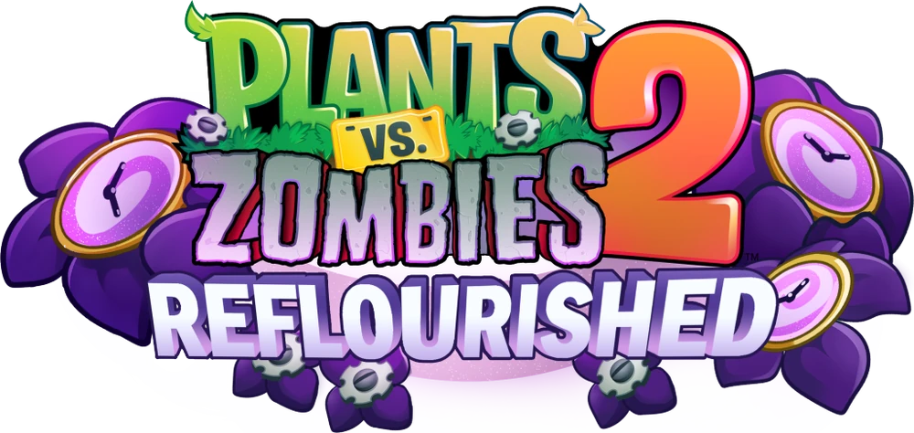</td><td align="center">⭐ <a href="https://drive.google.com/drive/folders/1y5lVZh-flKWxpeXSFYJprzJlL4Jlcfm4">Reflourished</a></td><td align="center">578&nbsp;/&nbsp;578<br>100%</td><td align="center">251&nbsp;/&nbsp;251<br>100%</td><td align="center"></td><td align="right">0</td><td align="center">✅</td><td align="center"><a href="https://github.com/lantern-fans/obbybackup/releases/tag/1.4.2-R1"></a></td></tr>
<tr><td align="center">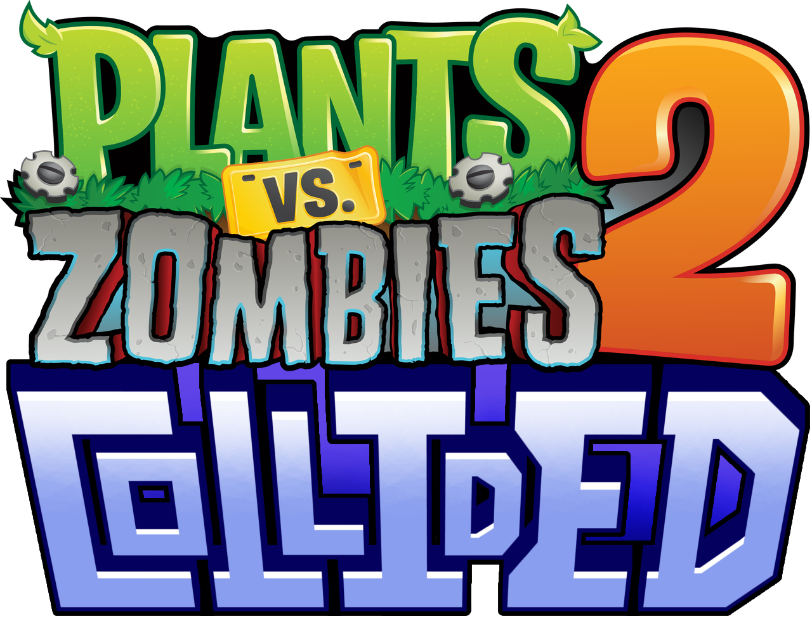</td><td align="center"><a href="https://drive.google.com/drive/folders/1MiMd_ecvIIH3XGcs8NeK7oLUxzvOf4OH">Collided</a></td><td align="center">65&nbsp;/&nbsp;71<br>92%</td><td align="center">0&nbsp;/&nbsp;5<br>0%</td><td align="center"></td><td align="right">11</td><td align="center"></td><td align="center"><a href="https://github.com/Milkypug2/pvz2collided/releases/tag/v1.1.0"></a></td></tr>
<tr><td align="center">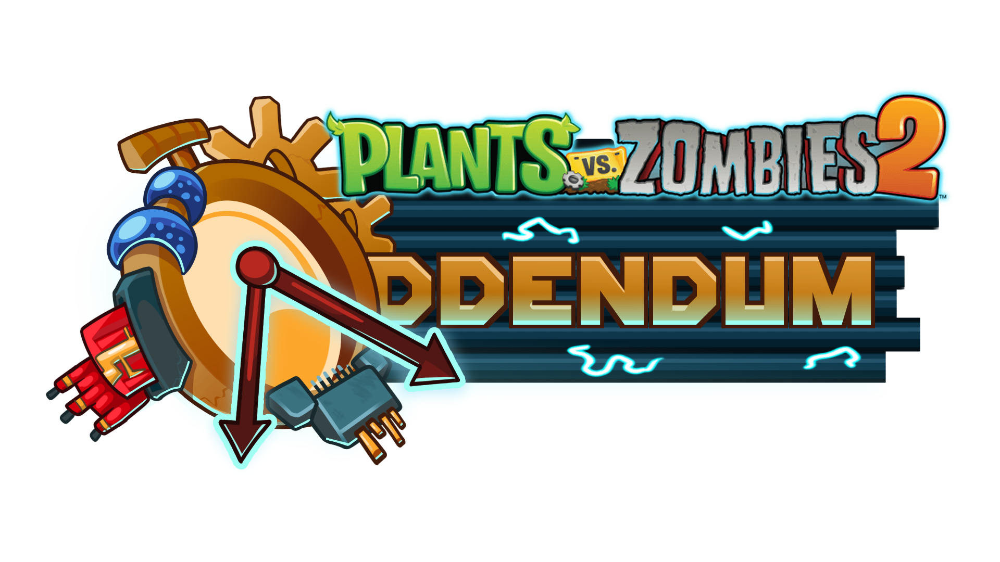</td><td align="center"><a href="https://drive.google.com/drive/folders/12Cm7Ojau_LsQnllR3LFMq0mkEoDNko7Y">Addendum</a></td><td align="center">100&nbsp;/&nbsp;112<br>89%</td><td align="center">11&nbsp;/&nbsp;24<br>46%</td><td align="center"></td><td align="right">25</td><td align="center"></td><td align="center"><a href="https://github.com/TheShero/TheShero/releases/tag/v1.0.2"></a></td></tr>
<tr><td align="center">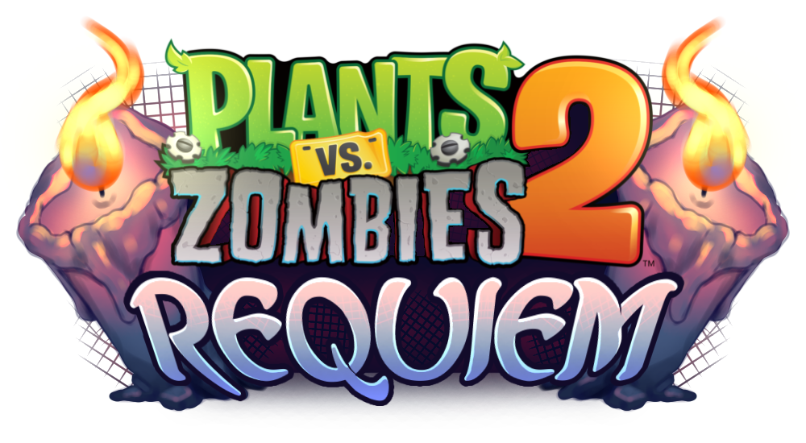</td><td align="center"><a href="https://drive.google.com/drive/folders/1A45mhlvghNYLBXI9HJqjdHyO6MvUdW29">Requiem</a></td><td align="center">23&nbsp;/&nbsp;196<br>12%</td><td align="center">-</td><td align="center"></td><td align="right">173</td><td align="center"></td><td align="center"><a href="https://github.com/PvZ2OBBHost/PvZ2RequiemOBB/releases/tag/v1.2.2b"></a></td></tr>
<tr><td align="center">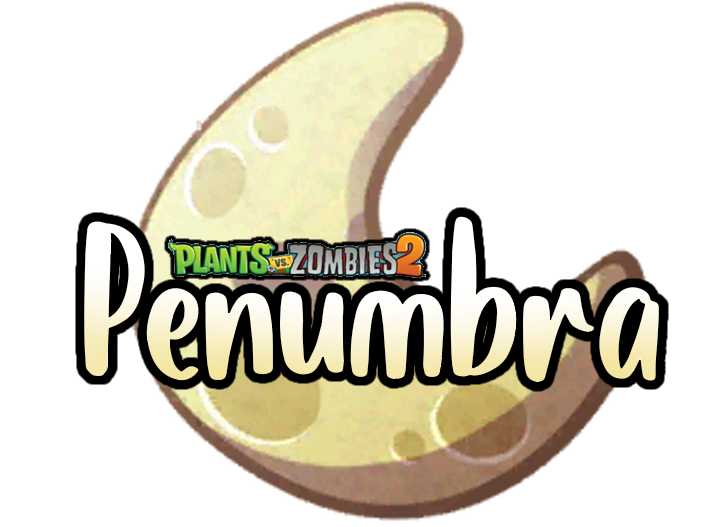</td><td align="center"><a href="https://drive.google.com/drive/folders/1GDnnr2nrWFBupEFWUvYN5EOP6x7QsnQL">Penumbra</a></td><td align="center">11&nbsp;/&nbsp;102<br>11%</td><td align="center">0&nbsp;/&nbsp;9<br>0%</td><td align="center"></td><td align="right">100</td><td align="center"></td><td align="center"><a href="https://github.com/PvZ2OBBHost/PvZ2PenumbraOBB/releases/tag/v1.3.1b"></a></td></tr>
<tr><td align="center">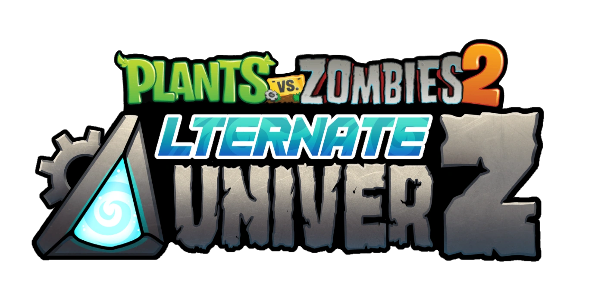</td><td align="center"><a href="https://drive.google.com/drive/folders/1ckXFy-1cv7Ka0eCxOXMweHWb_atzOc1z">Alternate&nbsp;UniverZ</a></td><td align="center">42&nbsp;/&nbsp;470<br>9%</td><td align="center">-</td><td align="center"></td><td align="right">428</td><td align="center"></td><td align="center"><a href="https://github.com/PvZ2OBBHost/PvZ2AltverZOBB/releases/tag/v1.8.2d"></a></td></tr>
<tr><td align="center">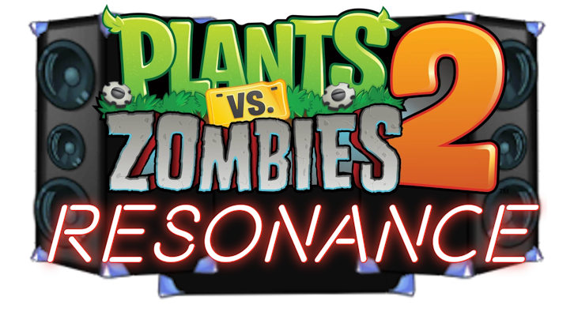</td><td align="center"><a href="https://drive.google.com/drive/folders/1QqS4lTbGtVvNR_kxPz9PwBRCk5yNKhAI">Resonance</a></td><td align="center">2&nbsp;/&nbsp;169<br>1%</td><td align="center">-</td><td align="center"></td><td align="right">167</td><td align="center"></td><td align="center"><a href="https://github.com/PvZ2OBBHost/PvZ2ResonanceOBB/releases/tag/v1.2.1b"></a></td></tr>
<tr><td align="center">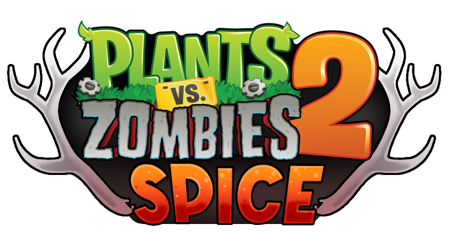</td><td align="center"><a href="https://peakedcomedy.itch.io/spice-reseasoned">Spice&nbsp;Re:Seasoned</a></td><td align="center">3&nbsp;/&nbsp;58<br>5%</td><td align="center">-</td><td align="center"></td><td align="right">55</td><td align="center"></td><td align="center"></td></tr>
<tr><td align="center"></td><td align="center"><a href="https://drive.google.com/drive/folders/1v2jT-DF6bmuP6drWfAd66EbDM_G072cd">Fallen</a></td><td align="center">2&nbsp;/&nbsp;215<br>1%</td><td align="center">-</td><td align="center"></td><td align="right">213</td><td align="center"></td><td align="center"></td></tr>
<tr><td align="center"></td><td align="center"><a href="https://drive.google.com/drive/folders/1UxRE6BW69D1QKfCusDfPxDV5jXU_kkLO">Solstice</a></td><td align="center">0&nbsp;/&nbsp;259<br>0%</td><td align="center">0&nbsp;/&nbsp;219<br>0%</td><td align="center"></td><td align="right">478</td><td align="center"></td><td align="center">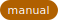</td></tr>
</table>

World is the levels the game shows on its world maps. Quest is the levels reachable only through the quest system, which is where the Epic chains live; a chain counts as done all at once, because that is the only granularity the save records. A dash means there is nothing to count: Requiem ships no registry at all, and Alternate UniverZ's quests are either switched off, repeating events, or levels already on its maps. The bar, Left and the tick all count both columns, so a mod is only finished once its quests are too. Mod names link to where the build came from. A blue badge links to the GitHub release the level count was read from, and is re-checked every run. Amber means the mod ships its OBB outside GitHub, so nothing can watch it: if that mod adds levels, the total here stays wrong until the count is rebuilt by hand.

## Which command

| I want to | Run |
|---|---|
| play, on whichever machine I am at | `python3 sync.py play` |
| put the mods on a machine that has none | `python3 install.py auto` |
| see whether a mod has a newer build | `python3 install.py status` |
| add a mod nothing here knows about | `python3 addmod.py <pkg> --link "<page>"` |

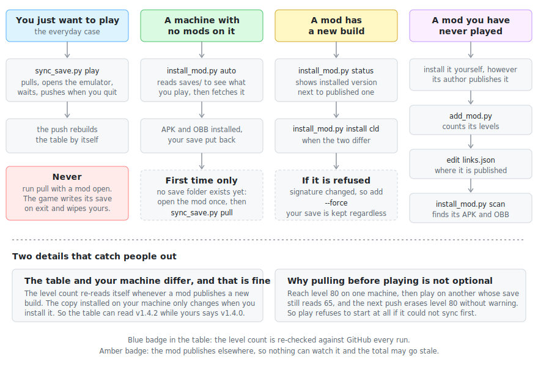

Every command is written `python3` here. **On Windows type `python`**, and
check once that it is the one you think, because a Windows machine usually has
three or four and `pip` belongs to whichever wins:

```
python -c "import sys, certifi; print(sys.executable); print(certifi.where())"
```

Two lines and you are set. An import error means that interpreter has no
certificates, so nothing here can reach the network: `python -m pip install
--upgrade certifi`.

Everything below is one section per situation. Open the one you need.

<details>
<summary><b>Playing, every time</b> &nbsp;·&nbsp; what <code>play</code> does, and the two guards that stop you losing a session</summary>

<br>

```
python3 sync.py play
```

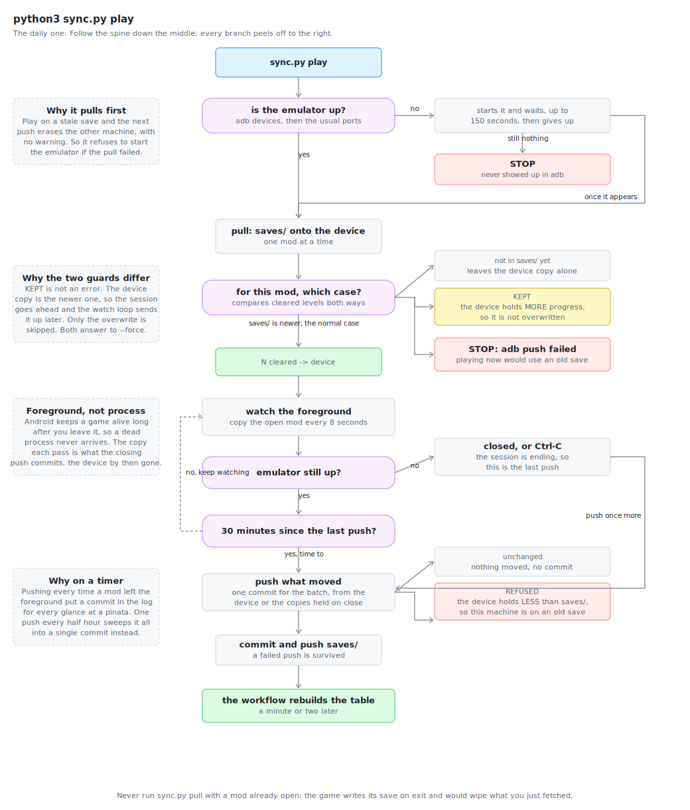

This is the whole routine. It connects to the emulator, copies the newest saves
onto it, starts it if it is not running, then watches. Each time you leave a
mod, that mod's save goes up straight away, and everything is swept once more
when the emulator closes. Those uploads are what refresh the table.

### Why it fetches before it lets you play

Say you reached level 80 on your desktop yesterday, then sit down at your
laptop today, whose save still reads level 65, and play without syncing. On
exit the laptop uploads its file and level 80 is gone, with no warning: to any
file-sync tool, the laptop's copy is simply the newer one. So `play` refuses to
start the emulator at all if it could not fetch the newest saves first.

The download happens once, at the start, and deliberately not again while you
play. A game reads its save when it launches, so a file arriving underneath one
that is already open is thrown away when you quit.

Which is also the one thing to avoid: **do not run `sync.py pull` with a mod
already open.** `play` gets the order right on its own, which is why it is the
one to use daily.

### The two guards

Both compare how many levels each copy has cleared, and they are not
symmetrical.

| | What happened | What it does |
|---|---|---|
| `REFUSED` | the device holds **less** than `saves/`, so this machine played on an old save | nothing is uploaded, and the session stops |
| `KEPT` | the device holds **more** than `saves/`, so this machine played and never pushed | the overwrite is skipped, and the session carries on |

`KEPT` is not an error. The copy on the device is the newer one, so playing is
safe and the watch loop sends it up when you leave the mod. Both answer to
`--force`, which is worth reaching for only when you know which copy you mean
to keep.

The guard counts levels on world maps. If a machine only finished a quest chain
and no map level, the two counts match and it cannot tell, so `sync.py push`
before leaving a machine is still the tidiest habit.

### Why it uploads per mod

A session that ends badly then costs you at most the mod you were in, not
everything you played that sitting. A push that fails, on a dropped network
say, is reported and stepped over: the commit is already here and rides up with
the next one.

Any byte counts as a change, not just a finished level. Coins and the level you
were last on move too, so a session where you cleared nothing still gets saved.

Closing the emulator with the mod still open is not a transition, and by the
time the device has gone there is nothing left to read off it. So a copy of
whatever is in front is taken on every pass, and that copy is what gets
committed if the emulator disappears. Reading a save from under a running game
is harmless; it is writing one underneath it that is not.

### What travels, and what does not

Two things go up, together and in the same commit.

`pp.dat` is the profile: levels cleared, plants, coins, finished quest chains.

`activequests/` is how far into a chain you have got, which `pp.dat` does not
record at all. It holds only that a whole chain finished, so a run stopped at
step 4 of 6 leaves no trace there. Stop halfway through Holly Barrier on one
machine and without this the other starts you at step 1. Under a thousand bytes
per mod, and it is refused and kept by the same rules as the save, since a
chain position read against the wrong profile is worse than none.

What stays behind is the board of a level you quit mid-run, which the game keeps
in `No_Backup/save/`. That is hundreds of megabytes of plants and zombies frozen
where you left them, tied to the machine that drew it, and worth nothing on
another. Quit mid-level on one machine and you replay that level, not the chain.

</details>

<details>
<summary><b>Putting the mods on a machine</b> &nbsp;·&nbsp; a fresh machine, updates, and the signature refusal</summary>

<br>

```
python3 install.py auto
```

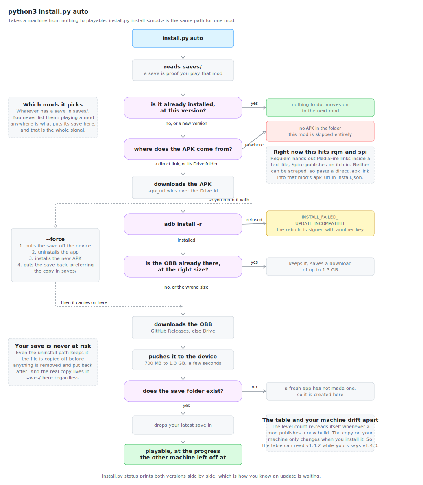

It reads `saves/` to see which mods you play, then downloads each one's APK and
OBB, installs both, hands the package the shared keyboard layout, and puts your
latest save in place.

You never list the mods. Playing one anywhere is what puts its save here, and
that is the whole signal.

A freshly installed app has not made its save folder yet, so the folder is
created and the save dropped straight in; the game reads it on first launch.
One command takes a machine from nothing to the same progress as the other one.
After that, `play` handles everything.

### One mod at a time

```
python3 install.py install cld
```

Use this for a single mod, or to put back one you uninstalled to save space.
Uninstalling loses nothing permanently, since the save lives here in `saves/`.

### Checking for updates

```
python3 install.py status
```

Prints the version installed here next to the version being published, plus the
size of the OBB on the device. When they differ, install it with the command
above.

Two things update independently, which is worth keeping straight:

- **The level count in the table** updates itself. When a mod publishes a new
  build on GitHub Releases, the next run re-reads the count. That is what the
  blue badge shows, and its version is the release it last read.
- **The mod on your machine** does not. Nothing reaches into your emulator
  uninvited; you install updates when you feel like it.

So the table reading v1.4.2 while your copy is on v1.4.0 is normal, not a bug.

### When the install is refused

`adb install -r` gets rejected when the new APK is signed with a different key,
which mod rebuilds often are. Android will not let one app replace another
unless the signatures match. Then:

```
python3 install.py install cld --force
```

`--force` uninstalls first, which is the only way past a signature change.
Normally that would delete your save with it. Not here: the save is copied off
the device before any uninstall and put back after, preferring the copy in
`saves/` since that is what your other machine last played.

### More than one build to choose from

Collided offers 30 and 60 FPS builds, Fallen 32 and 64 bit, Reflourished a
mirror. The scan will not choose for you, since choosing wrong installs
something you did not want:

```
python3 install.py pick cld "60_FPS"
```

The choice survives future scans, and only comes up again if files get renamed.

### Mods with nowhere to fetch from

Requiem puts MediaFire links inside a text file, Spice publishes on itch.io.
Neither can be scraped reliably, so paste a direct `.apk` link into that mod's
`apk_url` field in `install.json`. Until then those two are skipped, and a bare
machine simply comes up without them.

</details>

<details>
<summary><b>Adding a mod nothing here knows about</b> &nbsp;·&nbsp; the three things you have to supply yourself</summary>

<br>

Play a mod on any machine and its save reaches GitHub by itself, because
`sync.py` pushes the save of every mod installed on that device, known or not.
The mod then appears in the table straight away, but with no numbers: the save
says you play it, and nothing more. Counting its levels means reading its OBB,
which can only happen on a machine that has the mod installed, and knowing
where to download it later is something no save file records.

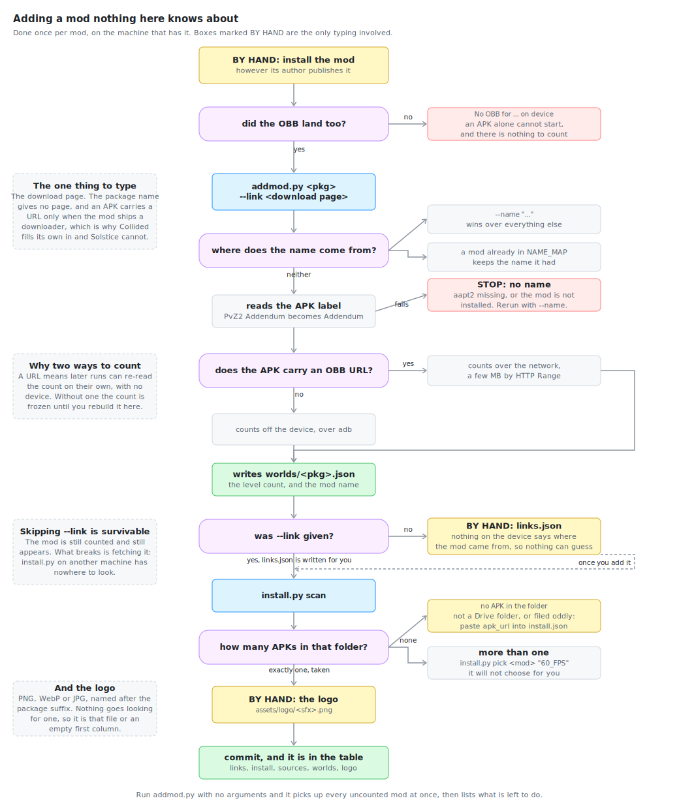

1. Install it yourself, however its author distributes it, and make sure its
   OBB really landed. An APK on its own gives an app that cannot start, and
   with no OBB there is nothing to count; that is what `No OBB for ... on
   device` means.
2. Count its levels, name it, and say where it came from:
   `python3 addmod.py com.ea.game.pvz2_sol --link "https://..."`
3. Find its APK and OBB: `python3 install.py scan`
4. Drop a logo into `assets/logo`, named after the package suffix.
5. Commit `links.json`, `install.json`, `sources.json`, the new `worlds/` file
   and the logo.

### What is worked out for you, and what is not

The name comes from the mod's own APK, so nothing has to be typed: Addendum
answers `PvZ2 Addendum` and is filed as Addendum. Pass `--name` only if that
comes out wrong. Reading the label needs `aapt2`, which ships with the Android
SDK next to `adb`.

Three things cannot be worked out, and they are the only typing involved:

| | Why not |
|---|---|
| **installing the mod** | every author publishes differently |
| **`--link`, its download page** | nothing on the device records where its mod came from. The package name gives no page, and an APK carries a URL only when the mod ships a downloader, which is why Collided fills its own in and Solstice cannot |
| **the logo** | `assets/logo/<sfx>.png`, WebP and JPG also read. Nothing goes looking for one |

Skipping `--link` is survivable: the mod is still counted and still appears.
What breaks is fetching it, so `install.py` on another machine has nowhere to
look. Run `addmod.py` bare and it does everything but that, then reminds you.

`--link` takes one mod, so name the package when you use it. Bare `addmod.py`
picks up every uncounted mod at once, and one page cannot describe them all.

### Getting the blue badge

To move a mod from the amber badge to the blue one, give its OBB a GitHub
Releases link in `sources.json`, shaped like
`https://github.com/OWNER/REPO/releases/download/TAG/FILE.obb`. Other hosts are
rejected on purpose: the update check works by asking the GitHub API for the
newest release and cannot do that elsewhere. A blue badge on a mod nothing is
actually watching would be worse than no badge.

</details>

<details>
<summary><b>Keyboard layout</b> &nbsp;·&nbsp; one keymap, every mod, every machine</summary>

<br>

```
python3 install.py keymap
```

The mods all draw the same UI, so one layout fits all of them: `Q W E R A S D F`
down the seed bank, `Tab` and `Ctrl` top right, `Shift` and `Space` along the
bottom. It lives in `keymap.cfg` here.

BlueStacks files these per package, so a mod you just installed starts with no
keys at all. `install.py` now hands each package the shared file as it installs
it, and the command above catches up anything already installed. Coordinates in
the file are percentages rather than pixels, so the same file works at any
window size and on any machine.

A layout you tuned for one mod is left alone. Add `--force` to replace it
anyway, or name one mod: `python3 install.py keymap rqm --force`.

Restart the emulator afterwards. BlueStacks reads these when a game launches.

### BlueStacks only

The file says so itself: every entry is typed `"$type": "Tap, Bluestacks"`.
LDPlayer, Nox and MEmu each invented their own format, and the Android Studio
emulator has no key mapping at all. On any of those the command reports that it
found nowhere to write and stops, which is also what happens on a machine with
no BlueStacks installed.

Where the files go:

| | |
|---|---|
| macOS | `/Users/Shared/Library/Application Support/BlueStacks/Engine/UserData/InputMapper/UserFiles` |
| Windows | `C:\ProgramData\BlueStacks_nxt\Engine\UserData\InputMapper\UserFiles` |

`UserFiles` is the folder for layouts you made yourself. The one beside it holds
the layouts BlueStacks ships, and those are replaced on update.

</details>

<details>
<summary><b>How the numbers are worked out</b> &nbsp;·&nbsp; the two columns, and what counts as a level</summary>

<br>

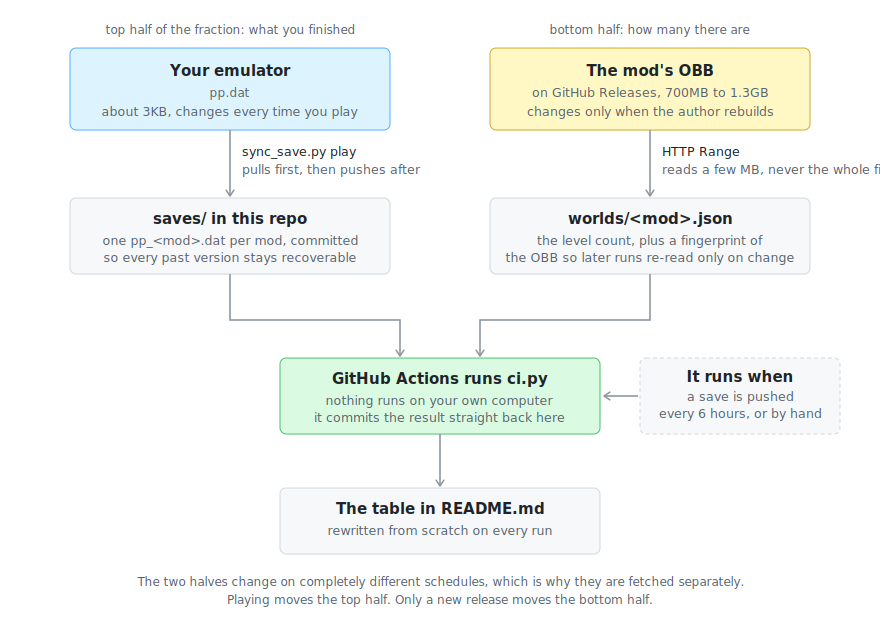

The percentage is a fraction, and its two halves come from different places.
The top half, how many levels you have finished, lives in the game's save file:
about 3KB, changing every time you play. The bottom half, how many levels the
mod has in total, lives inside its OBB, the big data file the game ships with,
somewhere between 700MB and 1.3GB, changing only when the author releases a new
build.

Nothing here downloads a whole OBB. It uses HTTP Range requests, which ask a
server for a slice of a file rather than all of it. The OBB keeps its table of
contents at the start, so a few scattered megabytes are enough to read every
world map inside. Each count is stored with a fingerprint of the file, so later
runs can tell in one request whether anything changed.

The table is rebuilt by GitHub Actions, so nothing runs on your computer. It
rebuilds every six hours, and also whenever a save is pushed here, which means
finishing a session updates it within a minute or two.

### World and Quest

**World** is what the game draws on its world maps, and is the number that was
checked against the game itself. The bar sits after both columns and reports
both, so a mod with its worlds finished and its quests barely started does not
draw the full green bar the world column alone would give it.

**Quest** is everything reached some other way. Two kinds of thing land here.

The first is the quest registry, which every mod ships as `QUESTS.RTON` beside
its world maps. That is where the Epic section lives: Addendum's Holly Barrier
is six levels there and appears on no map at all. A dash means there is nothing
to count: Requiem ships no registry, while Alternate UniverZ has one whose
quests are all either switched off, repeating seasonal events, or levels its
world maps already show.

The second is worlds that ship a map of their own but are reached through a hub
rather than from the main map, which is how Reflourished's Travel Log works.
Its sixteen hub worlds hold 251 levels, and that is the whole of its Quest
column; the 578 in its World column are the fifteen worlds on the map itself.

The two columns are kept apart instead of added together, for two reasons.
Quests often point back at levels already on the map, so adding them would
double-count; those are subtracted, and for Addendum that removed 57 of 81. And
they move differently: map levels count one at a time, a chain only when it is
finished, so a chain half played still reads as nothing done.

Levels a quest reaches that belong to a world rather than to a chain, like
Requiem's end-of-world bonus levels, are added to World instead. Daily
activities, piñata hunts, timed events and limited-time replays are dropped
entirely, along with the fifteen Travel Log worlds that replay past events:
they are old content on rotation, not something to finish. Counting them left
Reflourished short of 100% when in fact it was finished.

### What counts as a level

The numbers are meant to match what the game shows on each world map, which
took a few corrections to get right.

A level counts when it is a node on a world map, its type is `level`, and it
does not point at a Danger Room. Danger Rooms are excluded because the game
excludes them from its own totals.

Nodes are counted rather than distinct level IDs, because several map tiles can
share one ID and the game still counts each tile. No mod tracked here does that
at the moment, Addendum's Egypt being 44 tiles across 44 IDs, but an earlier
build of it did, and counting IDs would have read 40 where the game said 44.

A hidden world nothing points at stays out, being leftover vanilla content
still in the files but unreachable. So do the worlds behind a Travel Log hub
that ship no world map of their own, since their levels cannot be counted at
all. Reflourished keeps several hundred there, and every run notes underneath
the table which mods have content it cannot see.

</details>

<details>
<summary><b>Reference</b> &nbsp;·&nbsp; what each message means, and what each file does</summary>

<br>

### Messages

| Message | What is going on |
|---|---|
| `No PvZ2 mods are installed on ...` | Nothing to sync yet, because the machine has none of the mods. Run `install.py auto` first; it reads `saves/` and fetches what you play. |
| `No device` | The emulator is not running, or adb has not connected. The scripts try the usual ports themselves; if that fails, start the emulator first. |
| `could not read the save off the device` | The emulator went away before that mod could be read. The one that was open is committed from the copy held during play; the rest simply had nothing new. |
| `NOT FOUND` from `find` | That mod has never been opened here, so it has no save yet. Open it once. |
| `REFUSED: device has N cleared, saves/ has M` | This machine has less progress than the stored copy, so it played on an old save. Nothing was overwritten. Sync and replay, or use `--force` if you are sure this copy is the one to keep. |
| `KEPT: device has N cleared, saves/ has M` | The other way round: this machine played and never pushed, so fetching would have thrown those levels away. The device copy was left alone and playing can go ahead. Send it up with `sync.py push`. |
| `Pull failed, not starting the emulator` | Saves could not be brought up to date, so playing now risks losing another machine's progress. Usually network or git. |
| `this APK changed since last time` | The file at that link is not the one installed before. Nearly always a new build, but it is also what a swapped file looks like, so it gets reported. |
| `GitHub rate limit hit` | Anonymous API calls are capped at 60/hour. Progress still updates; only the release check is skipped that run. |
| `Folder is no longer public` | A mod's own download folder stopped being shared. Nothing here can reach its APK or OBB until its author shares it again, or until a direct link goes into `install.json`. |
| `CERTIFICATE_VERIFY_FAILED ... unable to get local issuer certificate` | Python cannot verify HTTPS, while git and your browser can, because they carry their own roots. The message names the interpreter it is running as; install certifi into that one. On Windows this usually means `python3` resolved to a Python you did not expect, an MSYS2 or Store build, while `pip` belonged to another. |
| `the folder listing came back empty` | A mod's Drive folder could not be read. Nothing is concluded from that and no recorded APK is dropped, so it is safe to ignore once the cause above is fixed. |
| `no BlueStacks keymap folder on this machine` | Key mapping is a BlueStacks feature in a format of its own, so there is nothing to write on another emulator. |

### Files

The four scripts at the top are the things you run. `pvz/` is what they are
built out of, grouped by what it touches.

| | |
|---|---|
| `sync.py` | Moves saves between the emulator and `saves/`. The daily one. |
| `install.py` | Installs and updates mods on a machine, and applies the keymap. |
| `addmod.py` | Sets up a mod the repo has never seen. |
| `track.py` | What GitHub Actions runs: reads saves, checks releases, rewrites the table. |
| `pvz/rton.py`, `pvz/rsb.py` | PopCap's binary JSON and archive formats. Everything depends on these. |
| `pvz/worlds.py` | Counts a mod's levels from its OBB. The counting rules live here. |
| `pvz/quests.py` | The other place levels live, and which of them are worth counting. |
| `pvz/save.py` | Reads a save file and works out what has been finished. |
| `pvz/totals.py` | Rolls every mod's counts into one file. |
| `pvz/github.py` | Asks GitHub whether a mod published a new build. |
| `pvz/drive.py` | Lists and downloads from a mod's public Drive folder. |
| `pvz/keymap.py` | Finds where BlueStacks keeps key layouts, and puts ours there. |
| `pvz/device.py`, `pvz/apk.py` | Talking to an emulator, and reading an installed APK. |
| `pvz/net.py` | HTTP, and the differences between operating systems. |
| `links.json` | Where each mod is published. Written by `addmod.py --link`, or by hand. |
| `install.json` | Which APK and OBB to fetch. Written by `scan`. |
| `sources.json` | OBB links pulled from each APK while the game was installed. |
| `keymap.cfg` | The shared keyboard layout, copied per mod. |
| `worlds/*.json` | Level counts per mod. Generated, so not worth editing. |
| `saves/*.dat` | The save files themselves. |
| `saves/quests_*/` | How far into each quest chain you are, which the save does not record. |
| `assets/logo/*` | One image per mod, named after the package suffix. Added by hand. |

</details>

<details>
<summary><b>Trying it without a second machine</b> &nbsp;·&nbsp; a throwaway emulator to rehearse the install path</summary>

<br>

A bare Android emulator stands in for a machine that has none of the mods, so
the install path can be exercised without touching the one you actually play
on. It needs a JDK, which Android Studio bundles, and an ARM system image.

```
export JAVA_HOME="/Applications/Android Studio.app/Contents/jbr/Contents/Home"
export ANDROID_SDK_ROOT=~/Library/Android/sdk
sdkmanager --install "system-images;android-33;aosp_atd;arm64-v8a"
avdmanager create avd -n mayB -k "system-images;android-33;aosp_atd;arm64-v8a"
~/Library/Android/sdk/emulator/emulator -avd mayB -no-window -no-audio -port 5580 &
```

Then clone this repo somewhere fresh and work in that copy, passing
`--device emulator-5580` so nothing reaches the real emulator by accident.

The mod will not actually run there: an ATD image has no GPU, and there is no
key mapping either. Installing, pushing the OBB and restoring the save all
work, which is the part worth checking. To rehearse the restore, put any save
at the mod's path first, since that is what opening the game once would
otherwise do for you.

Delete it afterwards with `avdmanager delete avd -n mayB`; the system image is
several gigabytes and lives under the SDK.

</details>
